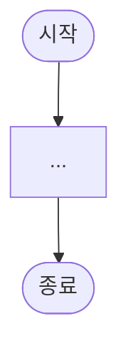

# make-flow-chart

업무흐름도(플로우차트) 작성용 skill. 기능 명세서가 아닌 **업무 흐름 파악** 목적의 산출물을 만든다.

## 기저 원칙

- **업무 흐름만**: 데이터 필드·옵션 상세는 모두 기능 정의서로 분리한다. 플로우차트는 흐름의 본질만 표현.
- **카테고리 단위 작업**: 한 번에 한 기능 영역의 모든 시나리오를 일관된 형식으로 다룬다.
- **합의 우선**: 각 phase는 사용자 합의 게이트가 있다. 합의 없이 다음 phase로 넘어가지 않는다.

---

## Core Workflow

### 0. 입력 수집

사용자에게 아래를 확인한다.

- 도메인 자료 위치 (Notion 페이지 URL / 로컬 md / 기타)
- 대상 기능 영역 (예: "자산관리", "상담 배정")
- 산출물 저장 위치 (디렉토리 경로)
- 다이어그램 도구 (기본: Mermaid)

### 1. 도메인 파악

- 자료 수집 (Notion fetch / Read / 기타)
- As-Is 큰 그림 정리: 이해관계자, 외부 의존, 데이터 보관 현황, 페인포인트
- 사용자에게 정리 결과 보여주고 확인

### → 도메인 파악 합의 (게이트)

### 2. 카테고리 체계 합의

- 시나리오 카테고리 후보 도출
- 분류 축 결정 — **객체 × 행위 매트릭스** 권장 (도메인 모델과 1:1, 시스템 설계로 전이 가능)
- 라이프사이클 단계 분류는 보편적이지만 추상적이고 도메인 특성에 맞지 않을 수 있음
- 복합 행위(예: "변경" = 회수 + 배정)는 primitive 시나리오로 분해 → 시나리오 수 축소
- 사용자에게 카테고리 표 보여주고 추가/제거/통합/이름 변경 합의

### → 카테고리 체계 합의 (게이트)

### 3. 산출물 형식 합의

- 1개 시나리오 샘플로 형식 제안 (시나리오 정의 표 + Step 시퀀스 표 + Mermaid 코드)
- 다이어그램 방향: TD 기본. LR은 분기 적고 step 긴 경우
- 추상화 레벨 L2 (한 시나리오당 5~10 step 권장)
- 사용자에게 형식 확인 받기

### → 산출물 형식 합의 (게이트)

### 4. 일괄 초안 작성

- 합의된 카테고리 수만큼 시나리오 작성
- 파일별 저장: `{idx}-{slug}.md` (예: `01-신규자산취득.md`)
- 각 파일은 동일한 3블록 구조 (아래 산출물 형식 참고)

### 5. 사용자 리뷰 → 보정

- **1번부터 하나씩** 검토
- 새 원칙 발견 시 **다른 시나리오에 즉시 일괄 적용** (검토 시 반복 작업 회피)
- 항상 mermaid 코드를 답변에 포함 (사용자가 Notion 등에 복붙해 검토하므로)
- 갱신 후 변경된 mermaid 코드를 답변에 같이 제공

---

## 산출물 형식

### 시나리오 파일 구조 (`{idx}-{slug}.md`)

````markdown
# {idx}. {시나리오 제목}

## 시나리오 정의

| 항목 | 내용 |
|------|------|
| 트리거 | ... |
| 행위자 | ... |
| 입력 | ... |
| 출력 | ... |
| 사전조건 | ... |
| 사후조건 | ... |
| 비고 | ... (선택) |
| 연관 카테고리 | [N](XX-slug.md) ... |

## Step 시퀀스

| # | 행위자 | 행위 | 분기/예외 |
|---|--------|------|-----------|
| 1 | ... | ... | — |

## Mermaid Flowchart


````

---

## 작성 원칙

### 텍스트 (표·노드 라벨)

- step "행위" 컬럼: **step 이름만**. 데이터 필드·옵션 목록 제거
- step "분기/예외" 컬럼: **흐름이 갈라지는 분기만**. 데이터 옵션은 기능 명세서로
- 시나리오 정의 입력/출력: **상위 카테고리 수준**
- Mermaid 노드 라벨: step 이름만, `<br/>` 뒤 상세 제거
- 세부 명세는 모두 기능 정의서로 분리

### Mermaid 표기

- 다이아몬드 텍스트: **명사형** (질문형 `?` 제거). `{X 여부}`, `{X 종류}`, `{X 지정}`
- Binary 분기: **`Y/N`**
- N-ary 분기: 명시적 라벨 (예: `사용자 / 조직 공용`)
- `+` 다음 항목: **무조건 줄넘김** (`<br/>+`)
- 노드 라벨에 `()` 괄호 포함 시: **따옴표로 감싸기** (`["X (조건)"]`) — mermaid 파싱 오류 방지
- 비즈니스 규칙(validation): **노드 라벨 + 괄호** (`["X 선택<br/>(조건)"]`)

### 매핑·관계 표기

- "매핑" 단어 사용 시 **무엇과의 매핑인지 반드시 명시**
  - ❌ "매핑 생성" / "매핑 해제"
  - ✅ "owner↔회선 매핑 생성", "전화 단말기↔회선↔owner 매핑 해제"
- 시나리오 전체에서 **일관된 표기 순서** 유지

### 용어 일관성

- 모든 시나리오에서 **같은 용어 사용**
- 1번에서 결정한 용어를 다른 시나리오에 일괄 적용
- 도메인 객체 용어는 **명확하고 직관적으로**. 모호하면 사용자에게 더 좋은 후보 제안
- 추상화 vs 직관성 trade-off는 사용자에게 보여주고 합의

### 검토 운영

- 1번부터 순차 검토
- 새 원칙 발견 시 **모든 시나리오에 즉시 일괄 적용** (Write로 통째 갱신)
- 검토 답변에 **mermaid 코드 항상 포함**

---

## 케이스별 판단 사항 (원칙 아님)

다음은 **도메인·요구사항에 따라 사용자와 합의해서 결정**한다. 매번 같은 답이 아니다.

- **시스템 자동화 vs 사용자 선행 행위**
  - 예: 회선 해지 시 매핑 자동 종결 vs 회수 시나리오 선행 실행
- **외부 의존 step의 표현**
  - 예: "외부 통신사 발급" step을 흐름에 포함 vs 사전조건으로 분리
- **비즈니스 규칙 표현 위치**
  - 흐름 분기(다이아몬드) vs 노드 라벨 괄호 vs 시나리오 정의 비고
- **매핑의 도메인 의미**
  - 3-way 통합 매핑 vs 여러 2-way 매핑 조합
- **다건 처리**
  - 단건 반복 가정 vs 다건 시나리오 분리

---

## 안티패턴

- step 행위·노드 라벨에 **데이터 필드 나열** (예: "분류, 단가, 모델명 입력")
- "매핑"만 쓰고 무엇과의 매핑인지 미명시
- 시나리오마다 **용어 다르게 사용** (예: "주체"와 "owner" 혼용)
- 검토 시 mermaid 코드 누락 (사용자가 복붙 검토 중)
- 카테고리 결정 전에 시나리오 개별 작성 시작 (체계 흔들림)
- "회수 + 배정" 같은 primitive 조합으로 표현 가능한 시나리오를 별도 카테고리로 유지
