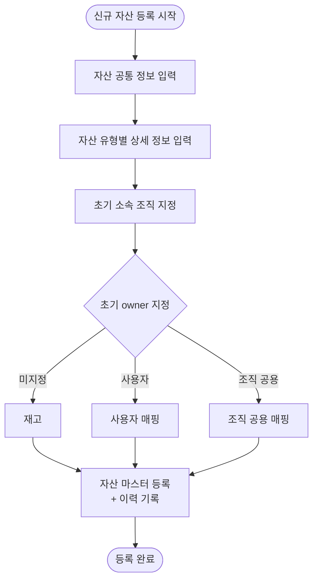

# 1. 신규 자산 취득

## 시나리오 정의

| 항목 | 내용 |
|------|------|
| 트리거 | 자산 유입 |
| 행위자 | 총무F |
| 입력 | 자산 정보, 초기 소속 조직, (선택) 초기 owner |
| 출력 | 자산 마스터 레코드 + 등록 이력 |
| 사전조건 | 총무F 권한 보유 |
| 사후조건 | 자산이 '재고' 또는 '배정 완료' 상태로 존재 |
| 비고 | 다건 등록은 단건 반복으로 처리 |
| 연관 카테고리 | [5](05-전화단말기회선배정.md) / [7](07-회선단독배정.md) (등록 후 배정), [2](02-자산폐기.md) (폐기로 종료) |

## Step 시퀀스

| # | 행위자 | 행위 | 분기/예외 |
|---|--------|------|-----------|
| 1 | 총무F | 신규 자산 등록 진입 | — |
| 2 | 총무F | 자산 공통 정보 입력 | — |
| 3 | 총무F | 자산 유형별 상세 정보 입력 | — |
| 4 | 총무F | 초기 소속 조직 지정 | — |
| 5 | 총무F | 초기 owner 지정 (선택) | 미지정(=재고) / 사용자 / 조직 공용 |
| 6 | 시스템 | 자산 마스터 등록 + 이력 기록 | — |

## Mermaid Flowchart

