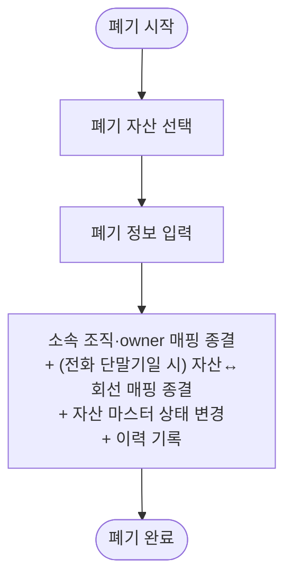

# 2. 자산 폐기

## 시나리오 정의

| 항목 | 내용 |
|------|------|
| 트리거 | 자산 사용 불가 (고장·노후화 등) |
| 행위자 | 총무F |
| 입력 | 폐기 대상 자산, 폐기 정보 |
| 출력 | 소속 조직·owner 매핑 종결 + (전화 단말기일 시) 자산↔회선 매핑 종결 + 자산 마스터 상태 → 폐기 + 이력 |
| 사전조건 | 자산이 마스터에 등록 |
| 사후조건 | 자산이 '폐기' 상태, 활성 매핑 모두 종결. 회선은 전화 단말기 미부여 상태로 유지 |
| 비고 | 다건 폐기는 단건 반복으로 처리 |
| 연관 카테고리 | [6](06-전화단말기회선회수.md) (회수 후 처리에서 폐기 분기로 연결될 수 있음) |

## Step 시퀀스

| # | 행위자 | 행위 | 분기/예외 |
|---|--------|------|-----------|
| 1 | 총무F | 폐기 자산 선택 | — |
| 2 | 총무F | 폐기 정보 입력 | — |
| 3 | 시스템 | 소속 조직·owner 매핑 종결 + (전화 단말기일 시) 자산↔회선 매핑 종결 + 자산 마스터 상태 변경 + 이력 기록 | — |

## Mermaid Flowchart

