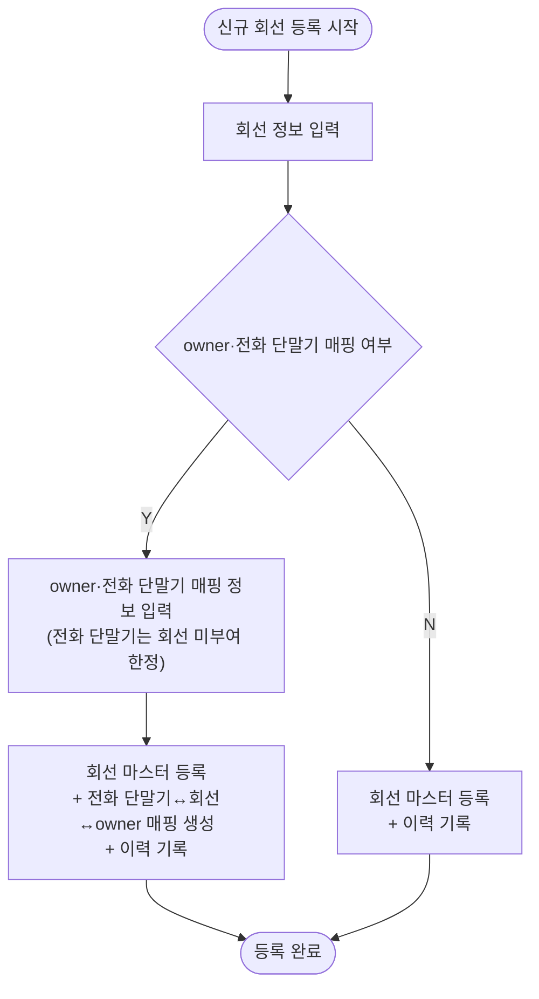

# 3. 신규 회선 등록

## 시나리오 정의

| 항목 | 내용 |
|------|------|
| 트리거 | 신규 회선 등록 필요 |
| 행위자 | 총무F |
| 입력 | 회선 정보, (선택) owner·전화 단말기 매핑 정보 |
| 출력 | 회선 마스터 레코드 + (매핑 시) 전화 단말기↔회선↔owner 매핑 + 이력 |
| 사전조건 | 외부 통신사로부터 회선 개통 완료 |
| 사후조건 | 회선이 '활성' 또는 '미배정' 상태로 존재 |
| 비고 | 매핑 시 이미 회선 부여된 전화 단말기는 선택 불가 (전화 단말기당 1회선 원칙) |
| 연관 카테고리 | [5](05-전화단말기회선배정.md) / [7](07-회선단독배정.md) (별도 매핑), [4](04-회선해지.md) (해지로 종료) |

## Step 시퀀스

| # | 행위자 | 행위 | 분기/예외 |
|---|--------|------|-----------|
| 1 | 총무F | 신규 회선 등록 진입 | — |
| 2 | 총무F | 회선 정보 입력 | — |
| 3 | 총무F | owner·전화 단말기 매핑 여부 선택 | Y / N |
| 4 | 총무F | owner·전화 단말기 매핑 정보 입력 (매핑 시) | (전화 단말기는 회선 미부여 한정) |
| 5 | 시스템 | 회선 마스터 등록 + (매핑 시) 전화 단말기↔회선↔owner 매핑 생성 + 이력 기록 | — |

## Mermaid Flowchart

