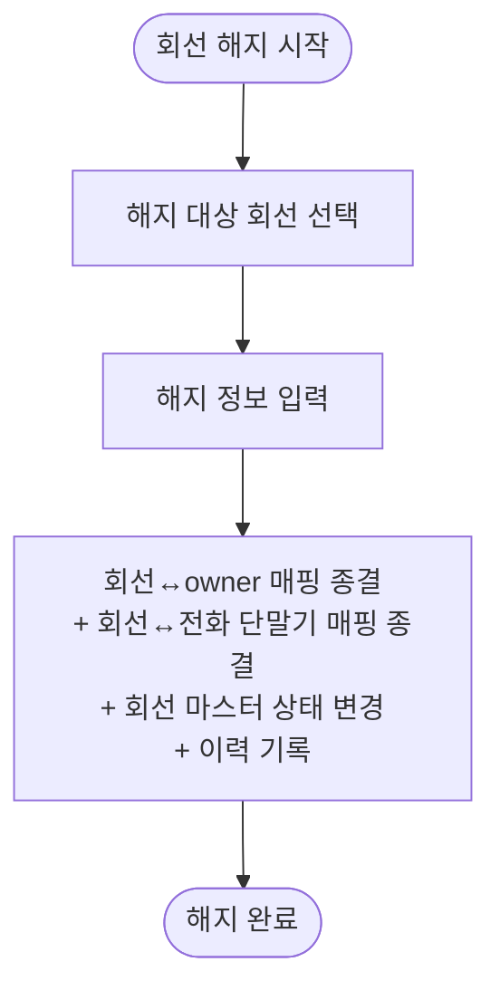

# 4. 회선 해지

## 시나리오 정의

| 항목 | 내용 |
|------|------|
| 트리거 | 회선 사용 종료 결정 |
| 행위자 | 총무F |
| 입력 | 해지 대상 회선, 해지 정보 |
| 출력 | 회선↔owner 매핑 종결 + 회선↔전화 단말기 매핑 종결 + 회선 마스터 상태 → 해지 + 이력 |
| 사전조건 | 외부 통신사 해지 완료, 회선이 마스터에 등록 |
| 사후조건 | 회선이 '해지' 상태, 활성 매핑 모두 종결. 전화 단말기는 회선 미부여 상태로 유지 |
| 비고 | 다건 해지는 단건 반복으로 처리 |
| 연관 카테고리 | [6](06-전화단말기회선회수.md) / [8](08-회선단독회수.md) (회수 후 처리에서 해지 분기로 연결될 수 있음) |

## Step 시퀀스

| # | 행위자 | 행위 | 분기/예외 |
|---|--------|------|-----------|
| 1 | 총무F | 해지 대상 회선 선택 | — |
| 2 | 총무F | 해지 정보 입력 | — |
| 3 | 시스템 | 회선↔owner 매핑 종결 + 회선↔전화 단말기 매핑 종결 + 회선 마스터 상태 변경 + 이력 기록 | — |

## Mermaid Flowchart

