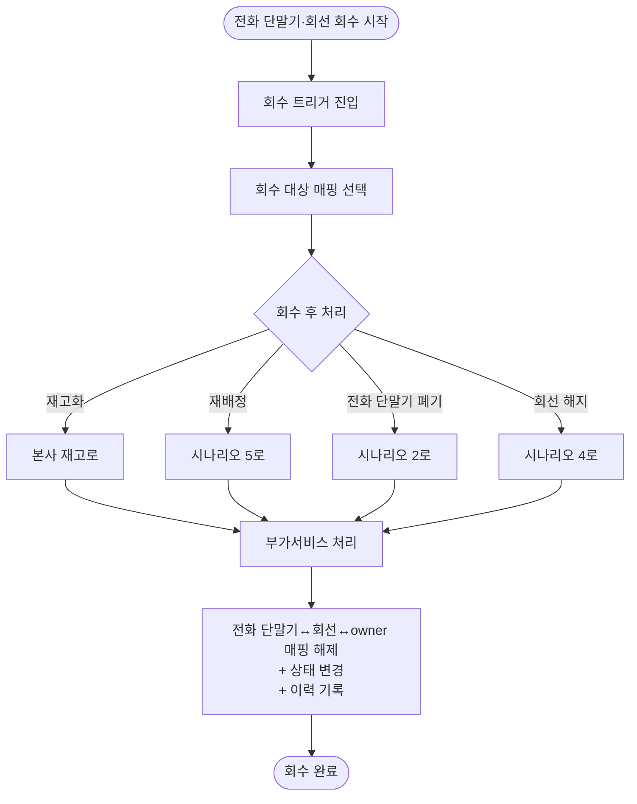

# 6. 전화 단말기·회선 회수

## 시나리오 정의

| 항목 | 내용 |
|------|------|
| 트리거 | 회수 필요 |
| 행위자 | 회수자 (총무F) |
| 입력 | 회수 대상 매핑, 회수 후 처리 방향 |
| 출력 | 전화 단말기↔회선↔owner 매핑 해제 + 자산·회선 상태 변경 + 이력 |
| 사전조건 | 전화 단말기↔회선↔owner 매핑 활성 |
| 사후조건 | 매핑 해제 |
| 연관 카테고리 | [5](05-전화단말기회선배정.md) (재배정), [2](02-자산폐기.md) (전화 단말기 폐기), [4](04-회선해지.md) (회선 해지) |

## Step 시퀀스

| # | 행위자 | 행위 | 분기/예외 |
|---|--------|------|-----------|
| 1 | 회수자 | 회수 트리거 진입 | — |
| 2 | 회수자 | 회수 대상 매핑 선택 | — |
| 3 | 회수자 | 회수 후 처리 선택 | 재고화 / 재배정 / 전화 단말기 폐기 / 회선 해지 |
| 4 | 회수자 | 부가서비스 처리 | — |
| 5 | 시스템 | 전화 단말기↔회선↔owner 매핑 해제 + 상태 변경 + 이력 기록 | — |

## Mermaid Flowchart

