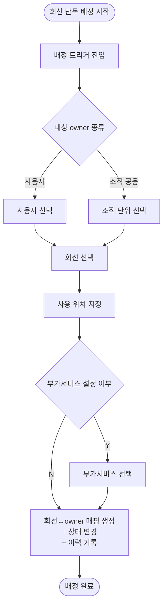

# 7. 회선 단독 배정

## 시나리오 정의

| 항목 | 내용 |
|------|------|
| 트리거 | 회선 단독 배정 필요 (본사 CS 인터넷전화 등) |
| 행위자 | 배정자 (총무F) |
| 입력 | 대상 owner, 회선, 사용 위치 |
| 출력 | 회선↔owner 매핑 + 회선 상태 → 활성 + 이력 |
| 사전조건 | 회선 미배정 |
| 사후조건 | 회선↔owner 매핑 활성 |
| 연관 카테고리 | [3](03-신규회선등록.md) (배정 전 등록), [8](08-회선단독회수.md) (회수) |

## Step 시퀀스

| # | 행위자 | 행위 | 분기/예외 |
|---|--------|------|-----------|
| 1 | 배정자 | 배정 트리거 진입 | — |
| 2 | 배정자 | 대상 owner 선택 | 사용자 / 조직 공용 |
| 3 | 배정자 | 회선 선택 | — |
| 4 | 배정자 | 사용 위치 지정 | — |
| 5 | 배정자 | 부가서비스 설정 | Y / N |
| 6 | 시스템 | 회선↔owner 매핑 생성 + 상태 변경 + 이력 기록 | — |

## Mermaid Flowchart

